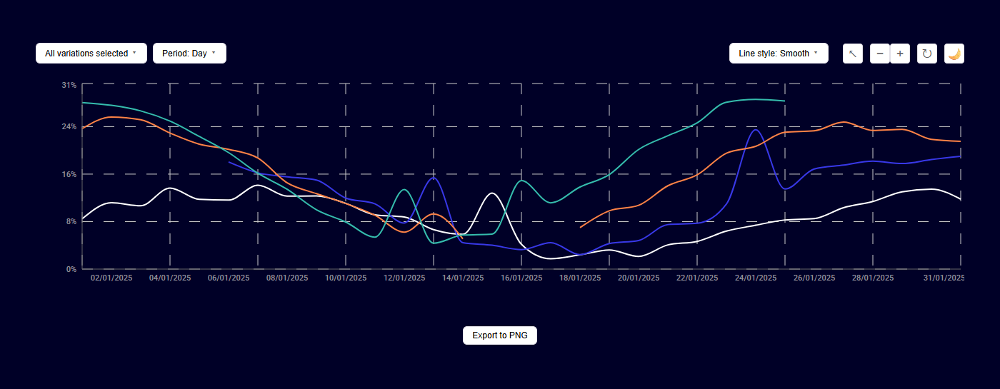
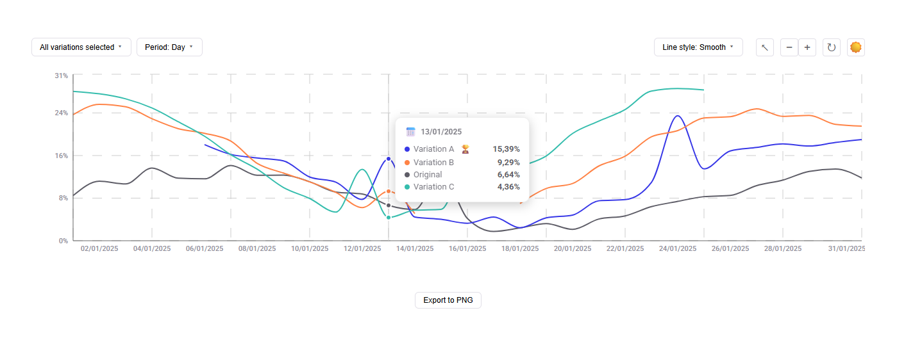
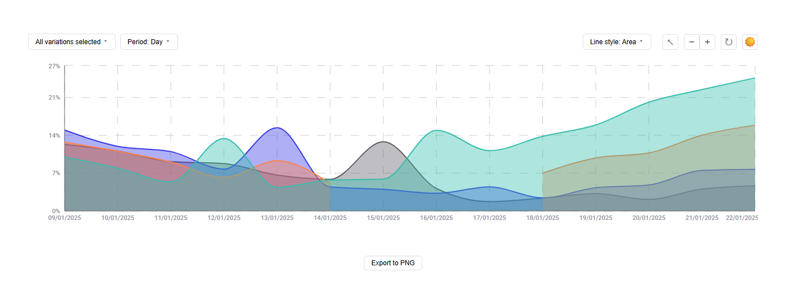
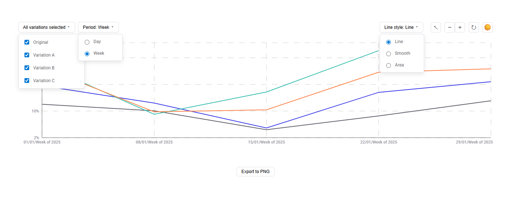

# 📊 Интерактивный график конверсий (A/B-тест)

Приложение для визуализации конверсий по вариациям A/B-теста.
Реализовано на React с использованием библиотеки Recharts. 
Проект выполнен как техническое тестовое задание.

## 🔧 Использованная библиотека визуализации

### Recharts --- https://recharts.org

**Почему Recharts:**

- Основана на React‑компонентах
- Декларативный API
- Хорошо кастомизируется
- Поддерживает TypeScript
- ResponsiveContainer
- Простая интеграция тултипов и областей

## ✨ Реализованный функционал

### Основной функционал

- Интерактивный линейный график конверсий
- Переключение периода отображения: день / неделя
- Выбор отображаемых вариаций
- Кастомныйй tooltip
- Значения отображаются в процентах
- Автоматический расчёт диапазона Y-оси
- Адаптивная верстка
- Полная типизация TypeScript
- Стили через CSS Modules

### Дополнительно реализовано

- Масштабирование (zoom in / out) и сброс масштаба
- Светлая и тёмная тема
- Переключение стиля линий: Line / Smooth / Area
- Экспорт графика в PNG (html2canvas)

## 📸 Скриншоты

### 🌞 Светлая тема

Основной вид графика в светлой теме с включёнными всеми вариациями.


---

### 🌙 Тёмная тема

Поддержка тёмной темы — одна из bonus-фич проекта.



---

### 📊 Tooltip с сортировкой и определением победителя

Показывает:

- дату,
- значения конверсии,
- сортировку по убыванию,
- индикатор победителя 🏆.



---

### 🔍 Зум графика

Увеличение диапазона данных с навигацией по истории зумов:



---

### 🎛 Панель управления

Включает:

- выбор вариаций,
- переключение периода
- выбор стиля линий
- кнопки масштаба
- переключатель темы
- экспорт в PNG



## 🏗 Структура проекта

    src/
    ├── components/
    │   ├── ConversionChart/
    │   ├── VariationSelector/
    │   ├── PeriodSelector/
    │   ├── LineStyleSelector/
    │   ├── ZoomControls/
    │   ├── ThemeToggle/
    │   └── ExportButton/
    ├── UI/
    │   ├── IconButton/
    │   └── UniversalSelector/
    ├── hooks/
    │   ├── useTheme.ts
    │   └── useZoom.ts
    ├── helpers/
    │   ├── chartCalculations.ts
    │   └── dateFormatters.ts
    ├── constants/
    │   ├── colors.ts
    │   ├── lineStyles.ts
    │   └── periods.ts
    ├── types/
    │   └── types.ts
    ├── lib/
    │   └── transformData.ts
    └── data/
        └── data.json

## 🚀 Локальный запуск проекта

### Требования

- Node.js 18+
- npm / yarn / pnpm

### 1. Клонирование проекта

```bash
git clone https://github.com/a9void/Interactive-Chart.git
cd Interactive-Chart
```

### 2. Установка зависимости

```bash
npm install
```

### 3. Запуск проекта в режиме разработки

```bash
npm run dev
```

➡ Открыть в браузере: http://localhost:5173

### 4. Сборка проекта

```bash
npm run build
```

### 5. Просмотр собранной версии

```bash
npm run preview
```

## 📊 Формат данных

```json
{
  "variations": [
    { "name": "Original" },
    { "id": 10001, "name": "Variation A" }
  ],
  "data": [
    {
      "date": "2023-06-01",
      "visits": { "0": 1000, "10001": 950 },
      "conversions": { "0": 45, "10001": 52 }
    }
  ]
}
```

## 🧠 Архитектурные решения

- Чёткое разделение: логика / UI / хелперы / типы
- Нормализация и подготовка данных в transformData
- Состояние управления вариациями, периодом и стилем в App
- Зум и тема вынесены в кастомные хуки
- Мемоизация для weekly-агрегации и отображаемого диапазона
- ooltip с сортировкой значений и выделением максимального

## 📝 Примечания

- Формула конверсии: (conversions / visits) × 100
- Недельная агрегация: группы по 7 дней
- Экспорт PNG сохраняет текущее состояние графика
